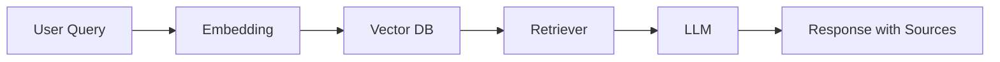

# 🚀 Darpan Nandgaonkar | ML Engineer

<p align="center">
  
</p>

<p align="center">
  <a href="#-about-me">About</a> •
  <a href="#-projects">Projects</a> •
  <a href="#-architecture">Architecture</a> •
  <a href="#-tech-stack">Tech Stack</a> •
  <a href="#-learning--vision">Vision</a> •
  <a href="#-contact">Contact</a>
</p>

---

# 🧠 About Me

```diff
+ Building AI that actually solves real-world problems
```

I am a **Machine Learning Engineer** focused on building:

* ⚡ Production-ready ML systems
* 🧠 Intelligent AI assistants (RAG, NLP)
* 🔍 Explainable & trustworthy AI

💡 I don’t just build models — I build **end-to-end intelligent systems**

---

# 🚀 Projects

## 🛡️ Fraud Investigation Assistant (RAG System)

```yaml
Problem: Analysts spend hours investigating fraud alerts
Solution: AI-powered assistant with grounded responses
```

✨ Key Highlights:

* Hallucination-safe **RAG architecture**
* Multi-query retrieval + re-ranking
* Grounded in AML rules & policies
* Focus on **trust + compliance**

---

## ♟️ Chess AI Coach

```yaml
Goal: Make learning chess intelligent & personalized
```

* Player pattern analysis
* Weakness detection
* Smart training recommendations

💡 Combining **coaching psychology + ML**

---

## 📄 Resume Screening AI

```yaml
Goal: Automate hiring decisions using NLP
```

* Resume parsing
* Candidate scoring
* Ranking system

⚡ Reduces manual effort drastically

---

# 🧩 Architecture (How I Think)



💡 I design systems that are:

* Explainable
* Scalable
* Reliable

---

# 🛠️ Tech Stack

## 👨‍💻 Languages


## 🤖 ML / AI


## 🔗 LLM / RAG


## ☁️ Tools


---

# 📊 GitHub Analytics

<p align="center">
  
  
</p>

---

# 🌍 Learning & Vision

```diff
+ "AI is not just about models, it's about impact."
```

I focus on:

* 📈 Continuous learning
* 🧠 Real-world problem solving
* 🚀 Building AI products (not just projects)

---

# 📚 Deep Dive Sections (Like Pages)

## 📌 Case Studies

* Fraud Detection RAG → (add repo link)
* Chess AI → (add repo link)

## 🧪 Experiments

* Model tuning logs
* Prompt engineering trials

## ✍️ Blogs (Future)

* RAG explained simply
* ML system design

---

# 🤝 Contact

```yaml
LinkedIn: YOUR_LINK
GitHub: YOUR_LINK
Email: YOUR_EMAIL
```

---

# ⚡ Fun Zone

> ♟️ I train chess players and machine learning models — both require strategy, patience, and continuous learning.

---

<p align="center">
  ⭐ If you like my work, give a star & follow!
</p>
